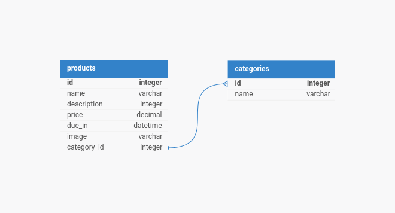

# Desafio Full Stack

O projeto está divido com a seguinte estrutura

```
desafio-fullstack
|─── docker
│   └─── development
|    │   └─── php
|    │       │   Dockerfile
|    │   └─── node
|    │       │   Dockerfile
|    │   └─── nginx
|    │       │   default.conf
└─── backend (Laravel v10)
└─── frontend (Vue 3)
│   .env.example
│   .gitignore
│   docker-compose.yml
```

Ao rodar o comando `docker compose up -d`, todos os serviços serão iniciados, entretando, é necessário que adicione as seguinte linhas no arquivo de hosts.

```
127.0.0.1    desafio.local
127.0.0.1    backend.desafio.local
```

### Database Schema



### Build
Até o presente momento é necessário fazer o build tanto da aplicação frontend quando backend manualmente.

```
docker compose exec backend composer install
docker compose exec backend composer run post-root-package-install
docker compose exec backend composer run post-create-project-cmd
docker compose exec backend php artisan migrate --seed
docker compose exec frontend npm run build
```


### Backend

Bibliotecas de instaladas
[Auth guard - jwt-auth](https://jwt-auth.readthedocs.io/en/develop/auth-guard/)


Será gerado um usuário padrão com as seguinte credencias

email: admin@admin.com
password: password

Também será gerado randomicamente produtos e categorias afim de acelerar o processo te testes

---

No backendHá as seguinte rotas

###### Rota padrão do laravel para checar manual se a aplicação está operacional

/


###### Rotas para autenticação com JTW utilizando a bibloteca **JWT-AUTH** para acelerar o desevolvimento.

POST api/auth/login

POST api/auth/logout

POST api/auth/me

POST api/auth/refresh


###### Rota publica para simular um sistema com acesso externo sem autenticação (apenas leitura)

GET|HEAD api/v1/public/categories

GET|HEAD api/v1/public/products


###### Rota para acesso autenticado

GET|HEAD api/v1/admin/categories

POST api/v1/admin/categories

PUT|PATCH api/v1/admin/categories/{category}

DELETE api/v1/admin/categories/{category}

GET|HEAD api/v1/admin/products

POST api/v1/admin/products

PUT|PATCH api/v1/admin/products/{product}

DELETE api/v1/admin/products/{product}


### Frontend

Bibliotecas instaladas

Bootstrap5
Axios
Vuex
FontAwesome
